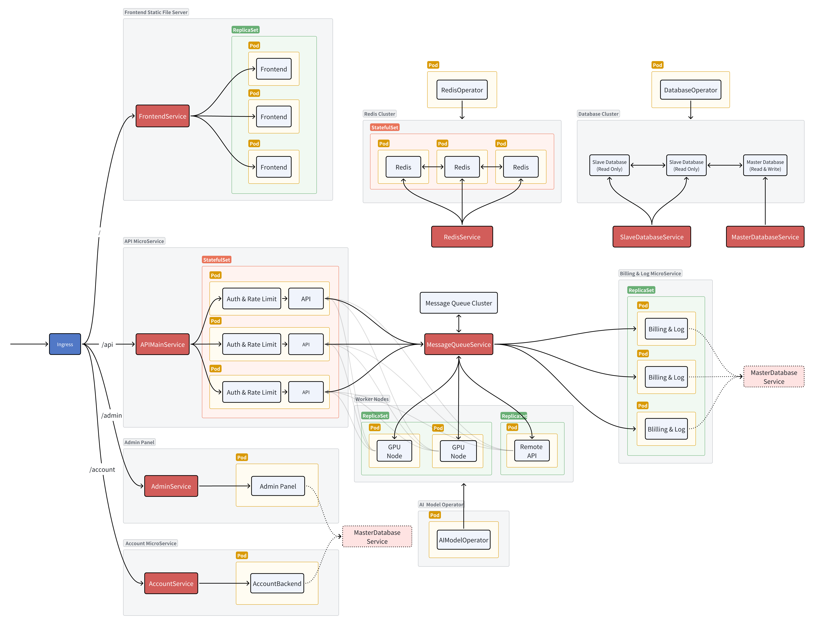

# Documentation

## Architecture

## Introduction

In the rapidly evolving landscape of AI services, we have all witnessed the growing pains of scaling and reliability. Remember last year's frustrations when popular AI services like **ChatGPT** faced frequent downtimes? These instances highlighted a critical question: How can we build more resilient AI infrastructures? Today, we are excited to introduce **uplion**—an experimental project exploring innovative solutions to this challenge.

Imagine being a developer with a fine-tuned model you need to deploy, or aiming to leverage multiple AI service accounts to increase concurrency. How would you approach building a system to handle these scenarios reliably and at scale? This is where **uplion** comes in.

So, what exactly is **UPLION**?

**UPLION** stands for Unified Platform for Leveraging Intelligent Operations in AI Networks. Let's break it down:

**U** - Unified Platform for AI: The foundation of uplion, serving as a comprehensive backbone for all your AI operations. It simplifies the complex AI landscape into a user-friendly, integrated environment.

**P** - Powered by cloud-native design: Built from the ground up to thrive in the cloud, ensuring scalability, resilience, and seamless updates—core attributes that modern AI systems demand.

**L** - Leveraging intelligent task distribution: Uplion employs smart algorithms to allocate tasks across the system, optimizing resource utilization and enhancing overall performance and reliability.

**I** - Innovative resource optimization: The platform dynamically allocates resources based on demand, ensuring efficient use of computational power and guaranteeing resource availability when needed.

**O** - Orchestrated with Kubernetes: Going beyond basic features like deployments and replica sets, uplion introduces a Custom Resource Definition (CRD) and a corresponding operator to implement bespoke logic tailored to its specific needs.

**N** - Next-generation AI infrastructure: Uplion represents a forward-thinking approach to AI system design, addressing current challenges while preparing for future advancements in the field.

This experimental project aims to revolutionize how we build and manage AI infrastructures, offering a glimpse into the future of resilient, scalable, and efficient AI systems.

### Unified AI Platform

At its core, UPLION aims to provide AI API services with the flexibility to deploy any model, **whether local or remote.** This versatility ensures that organizations can seamlessly integrate their finely-tuned models or utilize external AI capabilities.

Moreover, managing these integrations is straightforward. UPLION's design not only focuses on deploying AI models but also simplifies their management, ensuring that updates, scalability, and maintenance are efficient and straightforward.

Let's consider the practical applications of UPLION. Imagine an institution that wants to offer customized AI services to its members. With UPLION, this institution can deploy its tailored models to meet the unique needs of its members. This is particularly beneficial for AI startups. These emerging companies can deploy and manage their innovative models, test new ideas, and scale their operations efficiently within the UPLION ecosystem.

### Leveraging Cloud-Native Design

Let us examine the cloud-native design principles underpinning UPLION and explore its architectural components in detail.

Central to UPLION are several key elements: the main API service, a message queue, worker nodes, and an AI model operator. The AI model operator is pivotal in managing the worker nodes, a function we will explore shortly.

Consider a scenario wherein a client sends an API request. Initially, this request is processed by the main API service, which encapsulates the data and places it into the message queue under a topic corresponding to the model name. If a worker node is available and configured to handle this specific model, it retrieves the task from the queue, processes it, and returns the results to the main API service. Throughout this process, the client maintains a connection with the API node. Once the API node receives the response from the worker node, it relays the information back to the client.

This configuration forms the core architecture of UPLION. Additionally, several services are designed to augment functionality:

1. **Authentication and Rate Limiting Services**: These services function as middleware, processing requests before they reach the API node. They verify the validity of the request token, check if rate limits are within acceptable bounds, and determine if quotas have been exhausted. This primarily involves reading from the database, with nearly all data cacheable via **Redis**.
2. **Frontend**: Designed for usability, the frontend interface, similar to **ChatGPT**, enables users to interact seamlessly with the system.
3. **Admin Dashboard**: Utilizing Kubernetes and the operator, this dashboard provides a user-friendly interface for managing worker nodes (or AI models), as well as users and tokens.
4. **Account Services**: These services offer authentication for both the frontend and the management dashboard.
5. **Billing Service**: Upon task completion by a worker node, statistical information is placed into a batch processing queue. The account and billing services aggregate this data and consolidate it into a single database write request, significantly reducing database load.

For primary storage, we employ a **PostgreSQL** database cluster due to its robustness and reliability. Only the management dashboard and billing services need to write to the main database; other services require read access and thus connect to read replicas, utilizing a **Redis** cluster for caching. This setup enhances performance by providing rapid data access and reducing load on the database. It is important to note that throughout the entire API request process, there is no need to write to the database, ensuring that request concurrency and latency remain unaffected. For message queuing, we use **Pulsar**, chosen for its excellent scalability and capacity to handle high-throughput, low-latency messaging.

### Intelligent Self-Serving Task Distribution

Traditional designs often employ a central master node to allocate tasks to worker nodes. However, in UPLION, such a design is considered overly complex and difficult to maintain. Instead, the components are decoupled using a message queue. Worker nodes autonomously manage their own states. When a worker node determines it can handle an additional task, it retrieves a new task from the message queue under the topic corresponding to its designated model.

This architecture eliminates the need for a central coordinator. If the operator creates multiple instances of the same worker node, no additional adjustments are required. The message queue efficiently handles such scaling dynamics. This design inherently supports automatic scaling, making the system highly adaptable and efficient in managing resource distribution without the traditional overhead associated with task assignment.

### Optimizing Resource Allocation

A key attribute of UPLION is its capability for automatic scalability. This is facilitated through the use of KEDA (Kubernetes Event-Driven Autoscaling). When an AI model is instantiated, the operator automatically generates a KEDA ScaledObject, which in turn leads to the creation of a Horizontal Pod Autoscaler (HPA) by KEDA. The HPA continuously monitors the message queue, and if the number of unprocessed messages surpasses a predefined threshold, KEDA triggers the creation of additional pods to manage the increased workload. Conversely, if the number of unprocessed messages falls below the threshold, the number of pods is reduced accordingly.

In addition, when combined with the Cluster Autoscaler, if all nodes are heavily utilizing resources, new nodes are automatically provisioned to meet the demand. This seamless integration of KEDA with the Cluster Autoscaler ensures that UPLION can dynamically adjust its resources at both the pod and node levels, thereby meeting operational demands efficiently and effectively. This epitomizes true automatic scalability.

### Natively Integrated with Kubernetes

UPLION utilizes Kubernetes to efficiently manage worker nodes through the development of a custom operator named "AI Model Operator." To deploy a model, users need only create an AI Model object with specific parameters, and the operator will automatically establish the necessary deployments and pods. Should scaling be required, the operator also manages the KEDA configuration seamlessly.

Additionally, UPLION leverages Kubernetes' event system to implement a robust error-handling mechanism. In cases where irreversible errors occur within a worker node—such as configuration errors or invalid API keys—the node generates an event. The AI Model Operator captures this event and updates the status of the AI Model to 'Failed.' Once the configuration is corrected and reapplied, the status reverts to 'Running.' This integration streamlines the management of complex AI deployments and enhances system reliability and resilience, establishing UPLION as a truly Kubernetes-native solution.

video: https://www.bilibili.com/video/BV1qz8xeTEJf

## Technology

### Istio

In the UPLION architecture, Istio is leveraged to enhance authentication and rate limiting capabilities. Its contributions to these areas are as follows:

1. **Intercepting Requests for Middleware**: Istio intercepts requests before they reach the API node, extracts the API token from the request, and verifies its validity and quota. It also enforces rate limiting. This middleware mechanism clarifies the logic and simplifies both development and deployment processes.
2. **Observability**: Istio provides comprehensive observability features, including detailed logs, metrics, and tracing capabilities. These tools are invaluable for monitoring the health and performance of services in real-time, allowing for quick identification and resolution of issues, thereby ensuring high availability and performance.

### Programming Languages

The development of the main API service and the AI model operator utilizes Go. The main API service requires high concurrency, which Go handles efficiently. For the AI model operator, Go was chosen due to the convenience of the Operator SDK, which simplifies development considerably.

For the frontend and the admin dashboard, Next.js and React are employed. These frameworks provide robust tools for building interactive and dynamic user interfaces.

For components such as the worker node, where concurrency demands are lower, Python is used. Python offers simplicity and a vast ecosystem, making it ideal for tasks with less intensive concurrency requirements.

### Terraform

Terraform is used as the primary configuration and deployment tool across the entire architecture. Terraform is an open-source infrastructure as code software tool that enables users to define and provision data center infrastructure using a high-level configuration language. It supports multiple service providers, including AWS, where it can manage resources ranging from Elastic Kubernetes Service (EKS) clusters to databases and message queues, as well as the deployment of various applications.

To deploy the entire application from scratch, one only needs to execute two commands: `terraform init` to initialize the setup and `terraform apply` to apply the configurations and launch the resources. This deployment process will be demonstrated in detail during the upcoming demo.

Terraform significantly simplifies the deployment process, particularly in environments like the AWS Academy Learner Lab, where there is a frequent need to reset and redeploy resources.

### Demonstration
video: https://www.bilibili.com/video/BV1Zz8xeTETE
